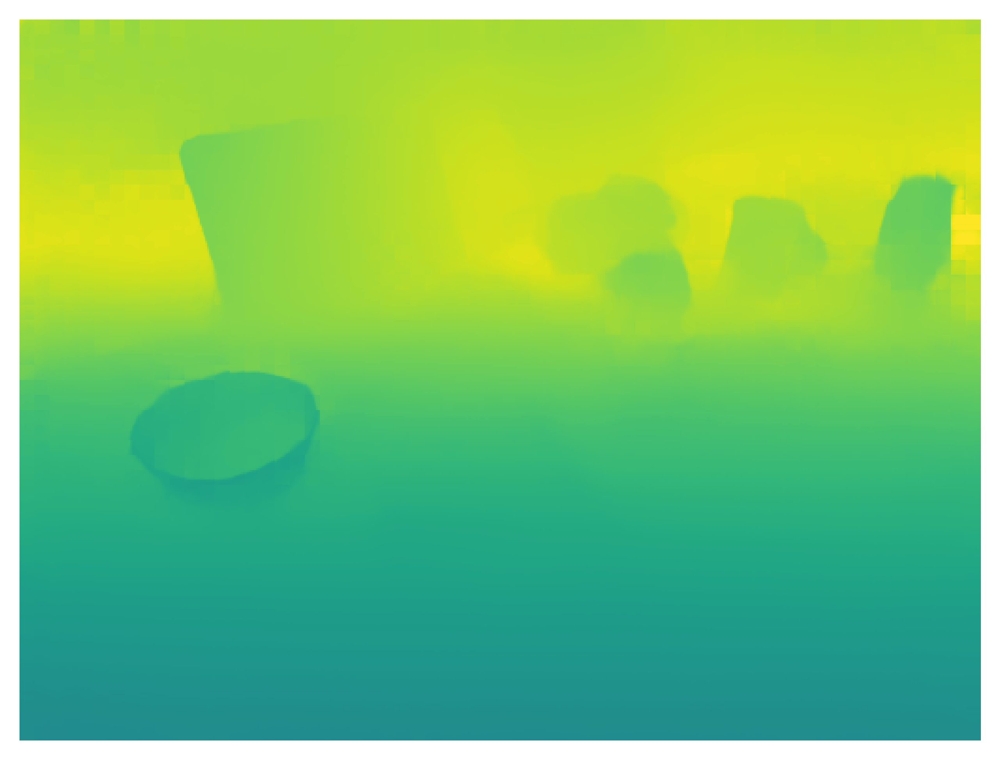
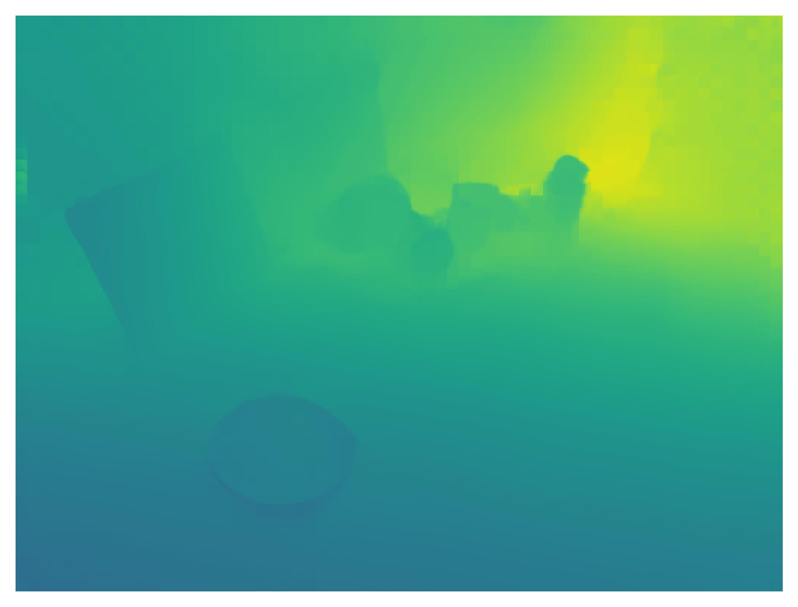
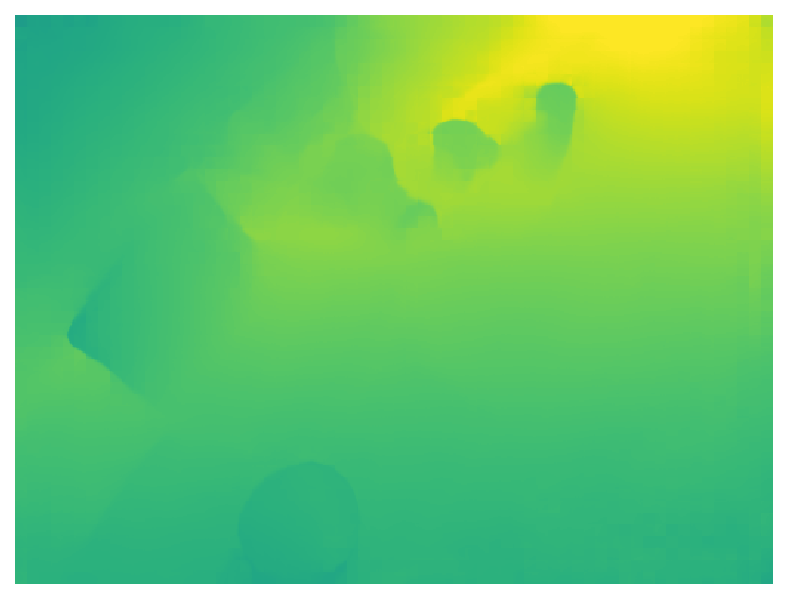

# MV-ROPE
The official implementation for MV-ROPE: Multi-view Constraints for Robust Category-level Object Pose and Size Estimation

# Install

The monocular_slam component relies on the DROID-SLAM framework. To install all necessary dependencies, please refer to the [instrustions](./monocular_slam/README.md) within the monocular_slam directory. *(For convenience, we have already included the source code for Eigen and Lietorch. You can simply compile the code without any additional steps.)*

The nocs_predictor component is relatively straightforward and requires only PyTorch and torchvision.

# Run

you can refer to the follow bash script to evaluate on REAL275

```bash
export CUDA_VISIBLE_DEVICES=0
i=1
j=6

for ((scene_num=i; scene_num<=j; scene_num++))
do
    scene_path="<path to nocs dataset>/real/real_test/scene_$scene_num"
    command="python ./evaluation_scripts/test_mv_rope.py \
             --datapath $scene_path \
             --mask \
             --nocs \
             --depth \
             --zero_depth \ # comment this line to enable RGB-D input instead of RGB-only
             --buffer 128 \ # if you have more GPU memory, you can make it bigger
             --frontend_window 16 \
             --keyframe_thresh 1 \
             --trajectory_path ./reconstructions/scene_$scene_num/traj_est.pkl \
             --reconstruction_path scene_$scene_num \
             --disable_vis
             "    
    eval $command
done


```

# Qualitative Results

<table>
  <tr>
    <td align="center">
      
    </td>
    <td align="center">
      
    </td>
    <td align="center">
      
    </td>
  </tr>
  <tr>
    <td align="center">
      
    </td>
    <td align="center">
      
    </td>
    <td align="center">
      
    </td>
  </tr>
  <tr>
    <td align="center">
      
    </td>
    <td align="center">
      
    </td>
    <td align="center">
      
    </td>
  </tr>
</table>

# Sample Data Download Link

Coming soon, we will put it in google drive...